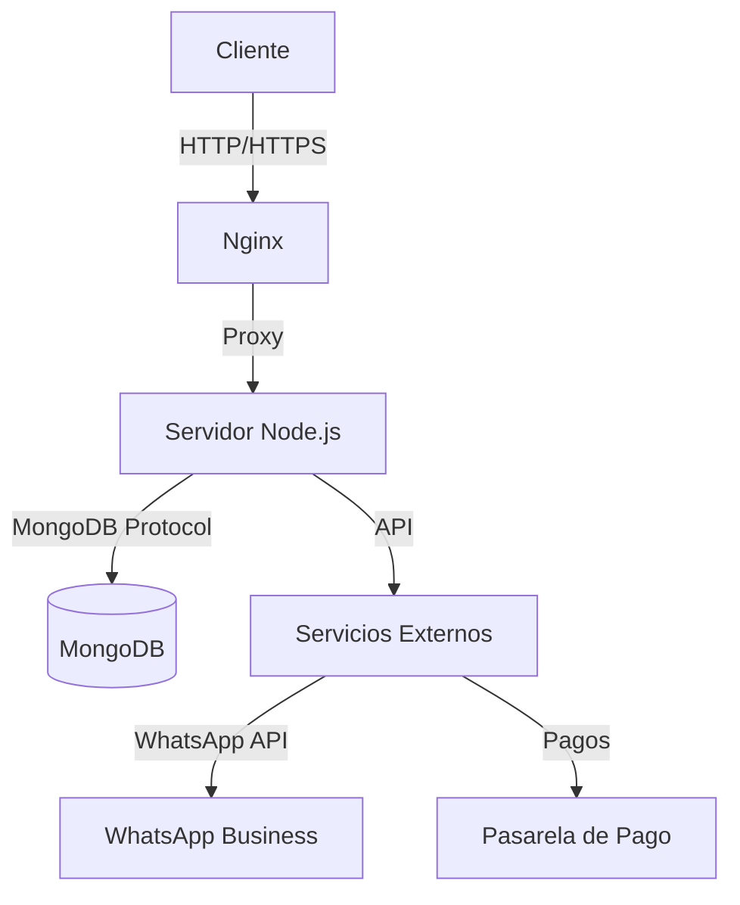

# Documentación Técnica

## Arquitectura del Sistema

### Diagrama de Arquitectura


### Tecnologías Principales
- **Frontend**: Astro, React, TypeScript, Tailwind CSS
- **Backend**: Node.js, Express
- **Base de Datos**: MongoDB
- **Autenticación**: JWT
- **Despliegue**: Docker, PM2, Nginx

## Estructura del Proyecto

### Directorios Principales
```
src/
├── components/     # Componentes reutilizables
│   ├── ui/        # Componentes de UI genéricos
│   └── sections/  # Componentes de secciones específicas
├── layouts/       # Layouts de la aplicación
├── lib/           # Utilidades y helpers
│   ├── api/       # Llamadas a la API
│   └── utils/     # Funciones de utilidad
├── pages/         # Rutas de la aplicación
│   ├── api/       # Endpoints de la API
│   └── [...].astro # Páginas de la aplicación
└── styles/        # Estilos globales
```

### Flujo de Datos
1. **Frontend**: Interfaz de usuario construida con Astro y React
2. **API Routes**: Manejo de solicitudes HTTP
3. **Servicios**: Lógica de negocio
4. **Modelos**: Esquemas de base de datos
5. **Base de Datos**: Almacenamiento persistente

## Modelo de Datos

### Esquema de Producto
```typescript
interface Product {
  _id: string;
  name: string;
  slug: string;
  description: string;
  price: number;
  originalPrice?: number;
  images: string[];
  category: string;
  brand: string;
  condition: 'new' | 'used' | 'refurbished';
  stock: number;
  specs: {
    storage: string;
    ram?: string;
    screenSize?: string;
    camera?: string;
    battery?: string;
  };
  tags: string[];
  rating?: number;
  reviews?: Review[];
  createdAt: Date;
  updatedAt: Date;
}
```

### Esquema de Orden
```typescript
interface Order {
  _id: string;
  user: string | User;
  items: {
    product: string | Product;
    quantity: number;
    price: number;
  }[];
  total: number;
  status: 'pending' | 'processing' | 'shipped' | 'delivered' | 'cancelled';
  shippingAddress: {
    fullName: string;
    address: string;
    city: string;
    postalCode: string;
    phone: string;
  };
  paymentMethod: string;
  paymentResult?: {
    id: string;
    status: string;
    update_time: string;
    email_address: string;
  };
  isPaid: boolean;
  paidAt?: Date;
  isDelivered: boolean;
  deliveredAt?: Date;
  createdAt: Date;
  updatedAt: Date;
}
```

## API Endpoints

### Productos
- `GET /api/products` - Listar productos (con filtros)
- `GET /api/products/:id` - Obtener producto por ID
- `POST /api/products` - Crear producto (admin)
- `PUT /api/products/:id` - Actualizar producto (admin)
- `DELETE /api/products/:id` - Eliminar producto (admin)

### Órdenes
- `GET /api/orders` - Listar órdenes (usuario autenticado)
- `POST /api/orders` - Crear orden
- `GET /api/orders/:id` - Obtener orden por ID
- `PUT /api/orders/:id/pay` - Actualizar orden a pagada
- `PUT /api/orders/:id/deliver` - Actualizar orden a entregada (admin)

### Autenticación
- `POST /api/users/login` - Iniciar sesión
- `POST /api/users/register` - Registrar usuario
- `GET /api/users/profile` - Perfil de usuario
- `PUT /api/users/profile` - Actualizar perfil

## Seguridad

### Autenticación
- JWT (JSON Web Tokens)
- Tokens de actualización
- Protección de rutas

### Validación de Entrada
- Validación de esquemas con Zod
- Sanitización de datos
- Protección contra inyección

### Seguridad HTTP
- Headers de seguridad (helmet)
- Rate limiting
- CORS configurado

## Rendimiento

### Caché
- Caché HTTP con Nginx
- Caché de consultas a MongoDB
- Redis para sesiones (opcional)

### Optimizaciones
- Compresión GZIP
- Minificación de recursos
- Lazy loading de componentes
- Optimización de imágenes

## Escalabilidad

### Estrategias
- Balanceo de carga con Nginx
- Escalado horizontal de instancias
- Base de datos replicada

### Monitoreo
- Logs con Winston
- Métricas con Prometheus
- Alertas con Grafana

## Integraciones

### WhatsApp Business API
- Envío de notificaciones
- Estado de órdenes
- Soporte al cliente

### Pasarelas de Pago
- MercadoPago
- PayPal
- Transferencia bancaria

## Migraciones

### Base de Datos
- Migraciones con Mongoose
- Scripts de migración
- Backup y restauración

### Actualizaciones
- Estrategia de versionado
- Migración de datos
- Rollback plan

## Documentación Adicional

### Diagramas
- Diagrama de secuencia
- Diagrama de componentes
- Diagrama de despliegue

### Decisiones de Arquitectura
- [ADR-001: Elección de Stack Tecnológico](./adr/001-stack-tecnologico.md)
- [ADR-002: Estrategia de Autenticación](./adr/002-autenticacion.md)
- [ADR-003: Manejo de Pagos](./adr/003-pagos.md)

## Glosario Técnico

- **JWT**: JSON Web Token, estándar para autenticación
- **REST**: Estilo arquitectónico para APIs web
- **MVC**: Modelo-Vista-Controlador
- **ORM**: Mapeo Objeto-Relacional
- **API**: Interfaz de Programación de Aplicaciones

## Referencias

- [Documentación de Astro](https://docs.astro.build/)
- [Documentación de MongoDB](https://docs.mongodb.com/)
- [Documentación de Node.js](https://nodejs.org/en/docs/)
- [Guía de Estilo de Airbnb](https://github.com/airbnb/javascript)
